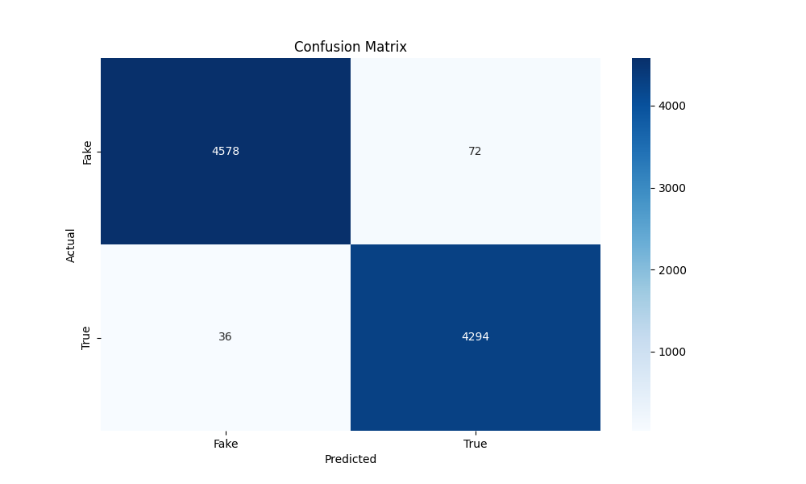
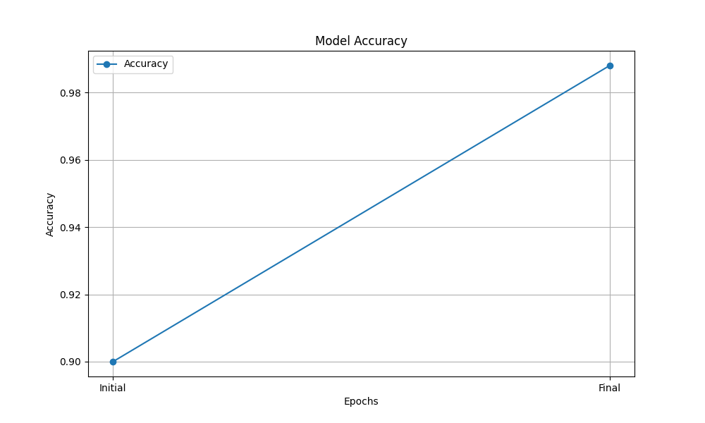

# NewsDetection

Check if the News is Fake or True

# Overview of the Application

This Flask application is designed to detect fake news articles using a trained machine learning
model. Users can log in, submit news articles for classification, and view statistics about the model's
performance. The application uses a web interface for interaction and relies on a SQLite database for
user management.
Key Components

1. Flask Framework:
   • Flask is a micro web framework for Python that allows you to build web applications
   quickly and easily. It provides tools and libraries to handle routing, sessions,
   templates, and more.
2. Machine Learning Model:
   • The application uses a trained logistic regression model to classify news articles as
   either "fake" or "true." The model is trained on labeled data (true and fake news
   articles) using techniques like TF-IDF vectorization.
3. Database:
   • A SQLite database is used to store user credentials (username and password) for
   authentication. The application connects to this database to verify user login
   information.
4. HTML Templates:
   • The application uses HTML templates (rendered with Jinja2) to create dynamic web
   pages. Templates allow you to separate the presentation layer from the business
   logic.

# train_model.py

This code implements a complete workflow for detecting fake news using machine learning:

1. It loads datasets containing true and fake news articles.
2. It prepares features and labels from these datasets.
3. It splits the data into training and testing subsets.
4. It vectorizes text data using TF-IDF.
5. It trains a logistic regression model on the training data.
6. It evaluates model performance using accuracy metrics and generates visualizations like
   confusion matrices.
7. Finally, it saves both the trained model and vectorizer for future use.
   This end-to-end process allows you to classify news articles effectively based on their textual
   content!

# Confusion Matrix

#Accuracy graph

# Technologies Used

1. Flask:
   In this project, Flask is used to create the web application that serves as the
   user interface for the fake news detection system. It handles routing (defining URL
   endpoints), session management (keeping track of logged-in users), and rendering
   HTML templates for dynamic content.

2. Pandas:
   In the project, Pandas is used to read CSV files containing true and fake news
   articles. It facilitates data handling by allowing operations such as combining
   datasets, cleaning data, and preparing features and labels for machine learning.

3. NumPy:
   Although not explicitly shown in your provided code, NumPy is often used in
   conjunction with Pandas for numerical operations and data manipulation.

4. Scikit-learn:
   The project uses Scikit-learn for several tasks:
   • Model Training: Logistic Regression is implemented as the classification
   algorithm.
   • Data Preprocessing: The TfidfVectorizer converts text data into numerical
   feature vectors suitable for machine learning models.
   • Model Evaluation: Functions like accuracy_score, classification_report,
   and confusion_matrix are used to assess model performance.

5. Matplotlib and Seaborn:
   These libraries are used to visualize the performance of the model through
   plots such as confusion matrices and accuracy graphs.

6. Pickle:
   In this project, Pickle is used to save the trained machine learning model and
   vectorizer to disk so they can be loaded later without needing to retrain them.

7. SQLite:
   SQLite is used to store user credentials (username and password) for
   authentication purposes. The application connects to this database to verify user
   login information.

# Summary of Workflow

1. Data Loading:
   • The application loads datasets containing true and fake news articles using Pandas.
2. Data Preparation:
   • The text data is combined into a single dataset, where labels are assigned (1 for true
   news, 0 for fake news).
3. Model Training:
   • The dataset is split into training and testing sets.
   • A TF-IDF vectorizer transforms the text data into numerical features.
   • Logistic Regression is trained on these features.
4. Model Evaluation:
   • After training, the model's performance is evaluated using metrics like accuracy and
   classification reports.
5. Web Application Interaction:
   • Users can log in through the Flask web application.
   • Users submit news articles through an input form.
   • The application processes the input using the trained model to classify it as fake or
   true.
6. Results Display:
   • The results are displayed back to the user along with explanations based on the
   model's predictions.

# Conclusion

This Flask application provides an interactive platform for detecting fake news using machine
learning techniques. Users can log in, submit news articles for classification, and view statistics about
model performance—all while leveraging a structured backend with SQLite for user management.
